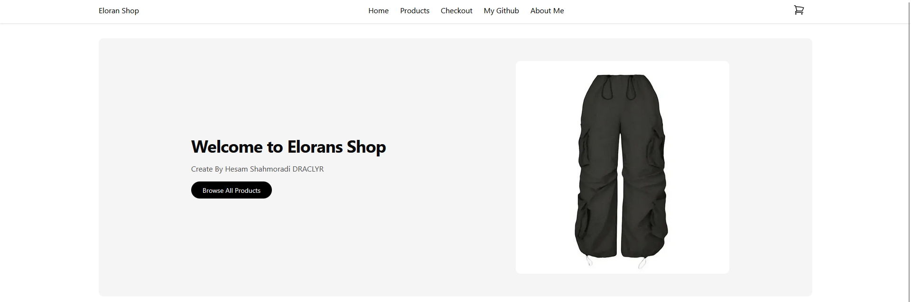
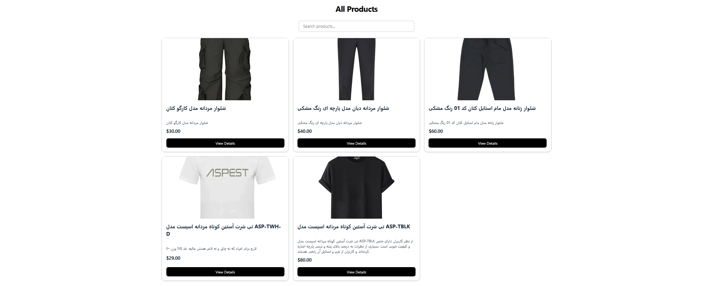
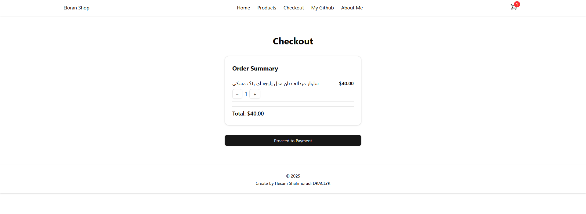

# Full‑Stack Ecommerce Platform Tutorial

   
    
   
  

    
    
    
    
    
   

  

## 📋Special section for products with professional search box
 
 
In this section, all products are easily and conveniently visible and accessible.

 

## 👌Checkout Section

The very important part of the checkout that shows your shopping cart information.

 

## ⚙️Project usage guide:
1. Install the template packages via the code below: npm install
2. Create Stripe Account For Products
3. Insert STRIPE code into the file: stripe.ts
4. And finally, in the terminal, run the code: npm run dev
 

I will be very happy if you rate the project❤️

